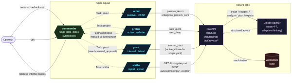
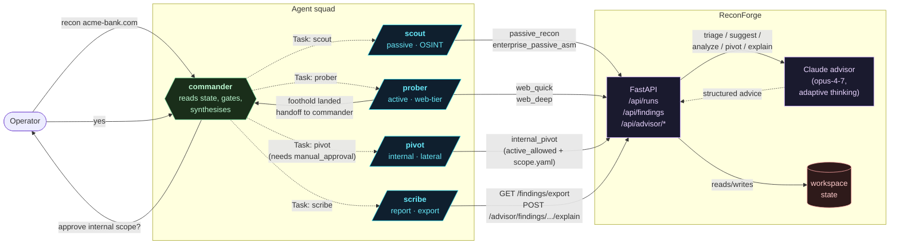

# ReconForge agent squad

Five Claude Code subagents covering the full lifecycle of a recon /
pentest engagement. One **leader** (Commander) orchestrates four
specialists who each own one phase of the work.

| Agent | Role | Phase | Active tools |
|---|---|---|---|
| **commander** | Leader — delegates, gates, synthesises | all | none (uses `Task` to delegate) |
| **scout** | Passive recon, OSINT, scope validation | T+0 | subfinder, crt.sh, gau, WebFetch |
| **prober** | Active web-tier scanning + finding triage | T+15 | httpx, nuclei, dalfox, ffuf, katana |
| **pivot** | Internal AD / lateral movement | T+45 (gated) | netexec, impacket suite |
| **scribe** | Reporting, evidence packaging | end | MD + HTML render, exports |

## Engagement flow

## Spawning

Each agent file in `.claude/agents/` is invokable two ways:

1. **Direct** — operator types `Use the prober subagent to run web_quick
   against api.acme-bank.com`.
2. **Via commander** — operator types `Recon acme-bank.com end to end`
   and Commander delegates via the `Task` tool, returning a single
   synthesized report.

## Hard gates (every agent honours these)

* `target.active_allowed === true` before any active probe (prober +
  pivot).
* A populated `scope.yaml` before pivot fires.
* `scope.require_high_risk_manual_approval === true` → Commander stops
  and asks before delegating to pivot.
* Anything in `packages/platform-config/sniper-inspired.yaml`
  `scope.default_out_of_scope` is always refused.
