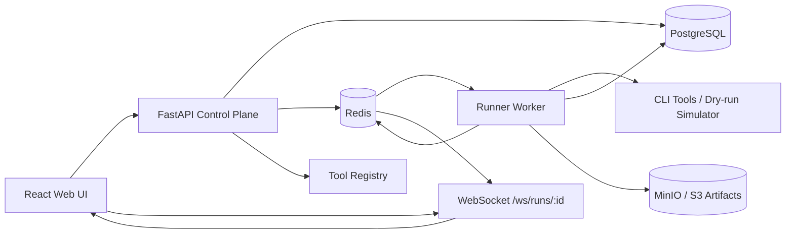
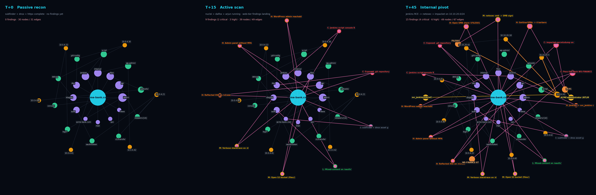

# ReconForge - Multi panel Web GUI with recon/ASM/bug bounty workflows.


> **History note.** This repo previously hosted a CLI-only 10-stage pipeline called *OneForAll*. That package is preserved under [`legacy/`](./legacy) and wired into the new system as registry tools (`oneforall`, `oneforall_s01_passive` … `oneforall_s10_report`) and a profile (`oneforall_chain`). See [`legacy/README.md`](./legacy/README.md).

> **Default safety posture is safe dry-run.**
> Fresh checkouts use `EXECUTION_MODE=dry_run` and `ALLOW_LIVE_EXECUTION=false`.
> Real tools require both flags to be deliberately changed, a target to be in
> scope, and active/high-risk authorization checks to pass. Treat live mode as
> an explicitly authorized lab/engagement setting, not a normal default.
> See [`docs/HARDENING.md`](./docs/HARDENING.md) for the operator safety checklist.

## What is included

- React + Vite + TypeScript frontend
- FastAPI control plane
- PostgreSQL-ready SQLModel models
- Redis-backed run queue
- Separate worker container for run execution
- Cancellable runs with worker-observed cancellation flags
- Per-step timeout, retry, retry-backoff, and optional continue-on-error policies
- Persistent `RunStep` records for operator-grade progress tracking
- Redis Pub/Sub-backed WebSocket event streaming
- MinIO/S3 artifact storage with local fallback
- Expanded declarative YAML tool registry with ProjectDiscovery/Sn1per-style ASM coverage
- Sn1per CE-inspired settings pack: plugin toggles, scanner integrations, GREP patterns, wordlists, Nmap ports, and safety limits
- Scope-aware run creation
- Safe `dry_run` execution mode by default
- Workspace / target / run / tool / artifact API surfaces
- Professional dark UI shell with dashboard, target manager, run console, artifact links, tool catalog, and React Flow workflow view

## Architecture



The API does **not** execute tools directly when `RUNNER_MODE=queue`. It validates scope, creates a run, persists a `run.queued` event, and pushes a job into Redis. The worker consumes that job, executes each profile step, persists events/assets/findings/artifacts, and publishes live events through Redis Pub/Sub.

## AI agents & automation

See **[AGENTS.md](./AGENTS.md)** for how external agents should communicate with the control plane: Claude advisor endpoints, structured run briefs (`GET /api/agent/runs/{id}/brief`), WebSocket events, artifact fetch patterns, and the **loot** layer (curated secrets/critical findings vs raw scanner noise).

## Repository layout

```text
apps/
  api/       FastAPI control plane + worker module
  web/       React/Vite frontend
packages/
  tool-registry/    YAML tool definitions and profiles
  platform-config/  Sn1per-style policy/config packs
  patterns/         GREP/high-value parameter pattern packs
  wordlists/        small starter wordlists for dev/lab use
infra/
  minio/     MinIO notes
scripts/     helper scripts
docs/
  screenshots/      generated UI screenshots (see `scripts/render-graph-screenshots.py`)
```

## Network graph

The web UI ships a Network Graph page that renders every workspace as a force-laid graph
of `target → domain → url → ip → finding` (plus internal `host` and captured `cred`
nodes once `internal_pivot` lands creds). Node size scales with networkx betweenness
centrality so pivot points jump out; edges are colored by relationship kind so an
operator can spot the critical hops at a glance.

The simulated screenshots below are produced by `scripts/render-graph-screenshots.py`,
which uses the same color palette, edge kinds, and centrality logic as the live
endpoint at `GET /api/workspaces/{id}/graph`. Re-run it after changing the layout to
keep the docs in sync:

```bash
python scripts/render-graph-screenshots.py   # writes docs/screenshots/*.png
```

### Engagement timeline (`acme-bank.com`)



| Frame | What's happening |
|---|---|
| **T+0 — Passive recon** ([single frame](docs/screenshots/network-graph-passive.png)) | `subfinder + dnsx + httpx` complete. Target hub at the centre, 12 subdomains, 10 URLs, 7 IPs. No findings yet — every edge is gray (`owns / hosts / resolves_to`). |
| **T+15 — Active scan** ([single frame](docs/screenshots/network-graph-attack.png)) | `nuclei + dalfox + arjun` running. 9 findings appear on the outer ring with severity-tinted labels (2 critical: exposed `.git`, Jenkins script-console RCE). Pink `finds` edges light up. |
| **T+45 — Internal pivot** ([single frame](docs/screenshots/network-graph-lateral.png)) | Jenkins RCE → `netexec + impacket` on `10.10.20.0/24`. Three orange `host` nodes (`DC01`, `FILES01`, `WS-FINANCE-07`), two yellow `cred` nodes (`svc_jenkins:S3cret!`, `ACME\administrator (NTLM)`), and orange `pivots_to` edges crossing from public IPs into the internal segment. 15 findings, 4 critical. |

Edge kinds in the live graph endpoint:

| Kind | Used between | Example |
|---|---|---|
| `owns` | target → domain | `acme-bank.com` → `api.acme-bank.com` |
| `hosts` | domain → url | `api.acme-bank.com` → `https://api.acme-bank.com/v1/users/{id}` |
| `resolves_to` | url → ip, host → ip | `https://...` → `10.0.4.21` |
| `finds` | target/asset → finding | `acme-bank.com` → `Reflected XSS on /v1/users` |
| `pivots_to` *(simulation only — not yet emitted by the API)* | external ip → internal ip | `10.0.4.41` → `10.10.20.5` |
| `captures` *(simulation only)* | host/ip → cred | `DC01.acme.local` → `ACME\administrator (NTLM)` |

The last two edge kinds appear in the screenshots to show where lateral-movement data
*will* slot in once the `internal_pivot` profile starts persisting host/cred records.
The current API only emits the first four kinds.

## Quick start

```bash
cp .env.example .env
docker compose up --build
```

Then open:

- Web UI: http://localhost:5173
- API docs: http://localhost:8000/docs
- MinIO console: http://localhost:9001

Default MinIO credentials:

```text
user:     reconforge
password: reconforge-secret
```

## Local backend dev

For full queue mode you need Postgres + Redis + MinIO running. Easiest path:

```bash
docker compose up postgres redis minio
cd apps/api
python -m venv .venv
source .venv/bin/activate
pip install -e .
uvicorn app.main:app --reload
```

Run a local worker in another shell:

```bash
cd apps/api
source .venv/bin/activate
python -m app.worker
```

## Local frontend dev

```bash
cd apps/web
npm install
npm run dev
```

## Execution modes

The backend defaults to `EXECUTION_MODE=dry_run`.

That means scan runs simulate tool output and normalize sample assets. This is intentional. Flip to `live` only inside an authorized lab or explicitly permitted bug bounty scope.

```env
EXECUTION_MODE=dry_run
ALLOW_LIVE_EXECUTION=false

# Dry-run pacing. 0.05s keeps demos readable; set to 0 in CI for fast tests.
DRY_RUN_LINE_DELAY_SECONDS=0.05

# Live mode requires both switches:
# EXECUTION_MODE=live
# ALLOW_LIVE_EXECUTION=true
```

## Runner modes

```env
RUNNER_MODE=queue       # API enqueues runs, worker executes them. Recommended.
RUNNER_MODE=in_process  # API executes with an in-process asyncio task. Dev only.
```

## Artifact storage

Compose uses MinIO-backed S3:

```env
ARTIFACT_BACKEND=s3
MINIO_ENDPOINT=http://minio:9000
MINIO_BUCKET=artifacts
```

Local fallback is also supported:

```env
ARTIFACT_BACKEND=local
ARTIFACT_DIR=./artifacts
```

Artifact metadata lives in Postgres. Artifact bytes live in MinIO/S3 or local disk. The UI links artifacts through:

```text
GET /api/artifacts/{artifact_id}/content
```

## First v1 loop

The first useful workflow is:

```text
domain -> subfinder -> crtsh -> dnsx -> httpx -> nuclei -> normalize -> artifacts -> report
```

The `passive_recon` profile now actually chains those steps via DAG artifact passing — `dnsx` and `httpx` consume the deduped union of every upstream `domain_list` output, not just the apex.

## DAG artifact passing

Each step's stdout is written to a per-run scratch directory at `${ARTIFACT_DIR}/runs/<run_id>/step_outputs/<NN>_<tool>.stdout.txt`. Subsequent steps can reference those files (and the merged-by-output-type file) through template variables in their argv:

```text
{{steps.<tool_id>.stdout_path}}        explicit upstream tool
{{previous.stdout_path}}                most recent prior step
{{upstream.<output_type>.merged_path}}  deduped union across all upstream tools
                                         that declared this output type
```

Profile steps can override the tool's argv inline rather than editing the tool YAML:

```yaml
- tool: dnsx
  argv_replace:
    - dnsx
    - -silent
    - -l
    - "{{upstream.domain_list.merged_path}}"
- tool: httpx
  argv_extra: ["-l", "{{upstream.domain_list.merged_path}}"]
```

`argv_replace` fully overrides the tool's default argv; `argv_extra` is appended. The rendered argv for each attempt is persisted into `RunStep.meta.argv`, so the UI / API consumers can show exactly what was executed.

This scaffold now includes **172 registry entries** and **28 scan profiles**, including passive ASM, ProjectDiscovery-style attack-surface discovery, DNS permutation/resolution, web fingerprinting, crawler/URL intelligence, content/parameter discovery, JS/secrets, API recon, cloud/takeover checks, port/service inventory, and a clean-room Enterprise ASM parity workflow. The current implementation executes those loops safely in dry-run mode through the worker container.

## Run control

Every profile step can define operational policy directly in YAML:

```yaml
steps:
  - tool: httpx
    timeout_seconds: 1200
    max_retries: 1
    retry_backoff_seconds: 2
  - tool: gowitness
    timeout_seconds: 1800
    max_retries: 1
    continue_on_error: true
```

The API exposes:

```text
POST /api/runs/{run_id}/cancel
GET  /api/runs/{run_id}/steps
```

Cancellation is requested through Redis and mirrored in the database. The worker checks before each step and while live tools are running. In live mode, subprocesses are launched as their own process group and terminated on timeout/cancel.

## Tool availability and live-run guardrails

ReconForge now exposes real tool availability checks through the API:

```bash
curl http://localhost:8000/api/tools/availability?force=true | jq
curl http://localhost:8000/api/tools/profiles/web_quick/availability?force=true | jq
```

The UI uses the same checks to show missing/broken badges in the Tool Catalog and to disable profile launch buttons when live execution is enabled. The backend also enforces this before a run is queued, so the browser is not trusted as a security boundary.

Dry-run mode remains intentionally forgiving: missing binaries do not block runs because fixture output is used. Live mode is strict by default:

```env
EXECUTION_MODE=live
ALLOW_LIVE_EXECUTION=true
BLOCK_LIVE_RUNS_ON_MISSING_TOOLS=true
```

You can inspect the local machine without running the API:

```bash
./scripts/check-tools.sh
```

Or compare against the API/runner image:

```bash
API=http://localhost:8000 ./scripts/check-tools.sh
```

## Theme

Two dark themes. Toggle from the top bar; the choice persists in `localStorage`.

- **Classic** — original cyan/teal look.
- **PD Cloud** — ProjectDiscovery-cloud-inspired: pink + cyan dual accent, sharper card borders, JetBrains Mono for everything code-shaped, tighter rounded corners. Opt-in; not the default.

## Tool library

The registry includes a clean-room, Sn1per/Enterprise-ASM-inspired set of **172** common building blocks. The categories are intentionally broad enough for a professional ASM/recon platform instead of a narrow “run a few bash tools” dashboard:

```text
reconnaissance, external-intel, network-intel, resolution, permutation, brand-intel,
probing, fingerprinting, screenshots, tls-security, url-discovery, crawling,
url-normalization, payload-prep, dedupe, content-discovery, vhost-discovery,
parameter-discovery, vulnerability-scanning, injection-testing, xss-testing,
cors-testing, api-security, secrets, supply-chain, takeover, cloud-security,
port-scanning, oob-testing
```

Representative tools now include:

```text
subfinder, assetfinder, amass, chaos, crt.sh, findomain, sublist3r, crobat, github-subdomains,
uncover, asnmap, mapcidr, dnsx, puredns, shuffledns, alterx, dnsgen, dnsrecon, dnstwist,
httpx, httprobe, tlsx, sslscan, testssl.sh, whatweb, wafw00f, gowitness, EyeWitness,
katana, gau, gauplus, waybackurls, waymore, hakrawler, gospider, urlfinder, paramspider,
LinkFinder, xnLinkFinder, JSFinder, uro, unfurl, qsreplace, anew, ffuf, feroxbuster,
dirsearch, gobuster, arjun, nuclei, nikto, dalfox, kxss, XSStrike, crlfuzz, Corsy, sqlmap,
Commix, kiterunner, GraphQL Cop, graphw00f, jwt_tool, cariddi, jsubfinder, gf, SecretFinder,
TruffleHog, Gitleaks, Retire.js, subzy, cloud_enum, s3scanner, cloudlist, naabu, rustscan,
masscan, nmap, interactsh-client, theHarvester, metagoofil, h8mail, whois, urlcrazy,
urlscan.io, Hunter.io, Tomba.io, IntoDNS-style checks, spoofcheck, dnscan, subjack,
subover, altdns, massdns, ssh-audit, smtp-user-enum, rpcinfo, safe SMB/NFS enum,
Burp/ZAP/OpenVAS/Nessus integrations, Arachni, BlackWidow, webtech, wig, CMSmap,
CMSeeK, Smuggler, Shocker, JexBoss, clusterd, CutyCapt
```

Useful registry helpers:

```bash
./scripts/tool-matrix.py        # render Markdown table of registry contents
./scripts/check-tools.sh        # show which live binaries are available on this host
./scripts/install-tools.sh      # best-effort bootstrap for common tools
```

Dry-run mode does not need these tools installed. Live mode does.


## Sn1per-style configuration pack

The CE snippet you shared maps cleanly into a modern config layer instead of one giant Bash settings file. ReconForge now ships:

```text
packages/platform-config/sniper-inspired.yaml
packages/patterns/sniper-grep-patterns.yaml
packages/wordlists/*.txt
```

API endpoints:

```text
GET  /api/config/effective
GET  /api/config/grep-patterns
GET  /api/config/wordlists
GET  /api/config/plugin-matrix
POST /api/config/reload
```

The UI has a **Settings Pack** page showing:

```text
- runtime limits: MAX_HOSTS, THREADS, MAX_JAVASCRIPT_FILES
- scope guardrails: out-of-scope patterns, active authorization, high-risk approval
- scanner integrations: Burp, ZAP, OpenVAS/GVM, Nessus, Metasploit import
- API integrations: Shodan, Censys, Hunter.io, Tomba.io, GitHub, WPScan, urlscan.io
- Slack notification toggles
- web brute stages and wordlists
- Nmap quick/default/full port profiles
- Sn1per-style GREP patterns for XSS, SSRF, redirect, RCE, IDOR, SQLi, LFI, SSTI, debug and high-value parameters
- plugin matrix grouped by recon, osint, active_web, passive_web, network, email, and DAST
```

Environment variables can override selected Sn1per-style toggles without editing YAML:

```env
OUT_OF_SCOPE=example.org,*.corp.example.org
MAX_HOSTS=2000
THREADS=100
MAX_JAVASCRIPT_FILES=25
NUCLEI=1
DIRSEARCH=1
NIKTO=1
WPSCAN=1
BURP_SCAN=0
ZAP_SCAN=0
OPENVAS=0
NESSUS=0
SLACK_NOTIFICATIONS=0
```

High-risk profiles now require `manual_approval=true` inside run params when the config says high-risk approval is required. Active profiles still require explicit target authorization.

## Safety posture

- Active tools require explicit target authorization.
- User input is validated before run creation.
- Commands are built as argv arrays, not shell strings.
- Dry-run is default.
- Tool definitions declare risk level.
- API and worker are separate processes.
- Event history is persisted in Postgres.
- Live event fanout uses Redis Pub/Sub.
- Artifacts are stored outside the database.

Do not expose this on the internet without real auth, TLS, runner isolation, rate limits, signed audit logs, and retention controls.

## Next milestones

1. ~~Add DAG artifact passing between steps instead of target-only templates.~~ **Done.**
2. ~~Add a typed artifact explorer with text/JSON/HTML/screenshot renderers.~~ **Done.** Click any artifact in the run console; `apps/web/src/lib/ArtifactExplorer.tsx` chooses a renderer per `classifyArtifact()`: text (filterable line view), JSON (pretty-printed), JSONL (each line parsed independently), HTML (sandboxed `srcdoc` iframe with no script/same-origin), image (inline ``), binary (download fallback). Range header for big files; click expand for full-screen.
3. ~~Add a real runner image with pinned tool versions and reproducible bootstrap.~~ **Done.**
4. ~~Add Alembic migrations before serious multi-user use.~~ **Done.**
5. ~~Add auth/RBAC and signed audit logs before any shared deployment.~~ **Done.** See "Auth & audit" below.

## Per-target detail view

The Targets page is now drill-in. Click a target value and you land on a per-target page with five tabs:

- **Overview** — counts of runs/assets/findings, findings split by severity, assets split by type, runs by status, last run timestamp, scope/auth state.
- **Assets** — every domain/url/ip/etc. asset discovered across runs against this target, with first-seen / last-seen and source tool. Filter by type.
- **Findings** — every Finding row, sorted critical → high → medium → low → info. Click a row to expand evidence.
- **Runs** — run history scoped to this target.
- **Tech** — aggregated tech stack (`tech: [...]`, `webserver`) extracted from httpx-style JSON assets, plus a per-URL breakdown.

Backend endpoints:

```text
GET /api/targets/{id}             # target itself
GET /api/targets/{id}/runs        # runs scoped to target
GET /api/targets/{id}/assets?type=url
GET /api/targets/{id}/findings    # severity-ranked
GET /api/targets/{id}/summary     # rolled-up counts
GET /api/targets/{id}/tech        # tech aggregation from httpx-style assets
```

Asset isolation is tested explicitly: assets discovered through a run targeting host A do not appear in host B's view.

## Auth & audit

Authentication is mandatory on all `/api/*` routes (`/health` is open).

- Three roles: `viewer` (read-only), `operator` (create targets, queue runs), `admin` (manage users + API keys + workspaces). Hierarchy enforced via `require_role()`.
- Login → bearer token. POST `/api/auth/login` returns a `rcf_…` token shown ONCE; only its `prefix` and `sha256(token)` land in the DB.
- `Authorization: Bearer <token>` on every request; revoke via `DELETE /api/auth/api-keys/{id}`.
- Bootstrap admin via env: `RECONFORGE_BOOTSTRAP_ADMIN_USERNAME` + `RECONFORGE_BOOTSTRAP_ADMIN_PASSWORD`. Lifespan creates-or-updates the user on every boot.
- Passwords: PBKDF2-HMAC-SHA256, 200k iterations, random 16-byte salt.

The audit log (`AuditEvent`) is append-only and hash-chained:

```text
signature_n = sha256(prev_signature || canonical_json(row_n))
```

If `RECONFORGE_AUDIT_HMAC_KEY` is set, an HMAC over the same body is also stored alongside the payload. `verify_chain()` re-walks every row and reports breaks: `signature mismatch`, `prev_signature mismatch`, `non-contiguous sequence`, or `_hmac mismatch`. `GET /api/auth/audit` (admin-only) shows the most recent rows and the verification result.

What gets audited: every login attempt (success/failure), API key creation/revocation, user creation, workspace creation, target creation, run creation, run cancellation. Failed logins are recorded with no actor so brute-force attempts leave a trail.
