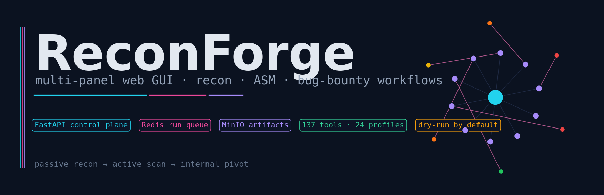
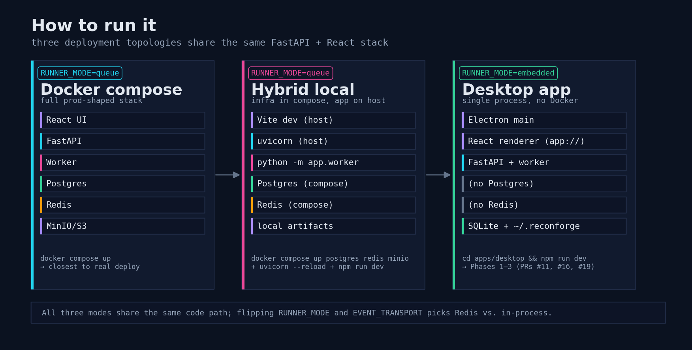
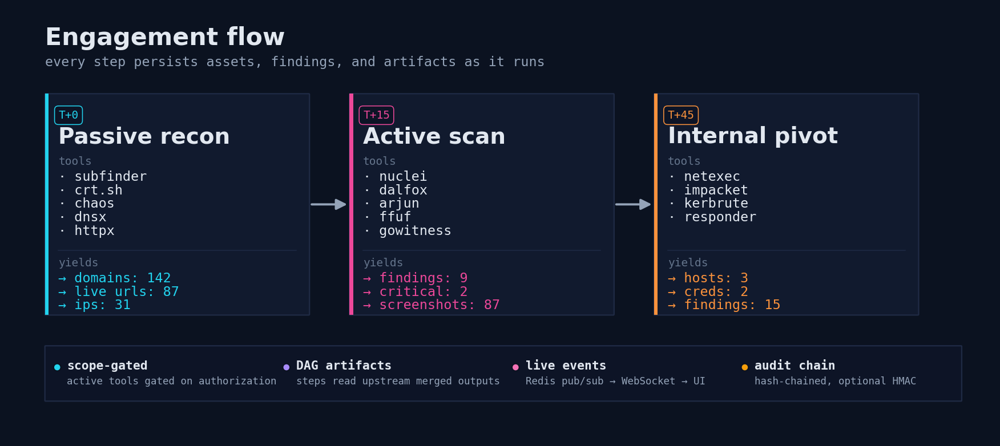
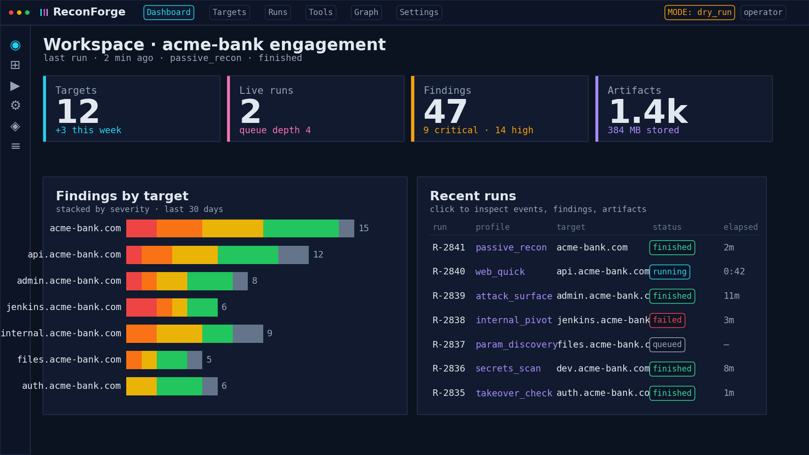
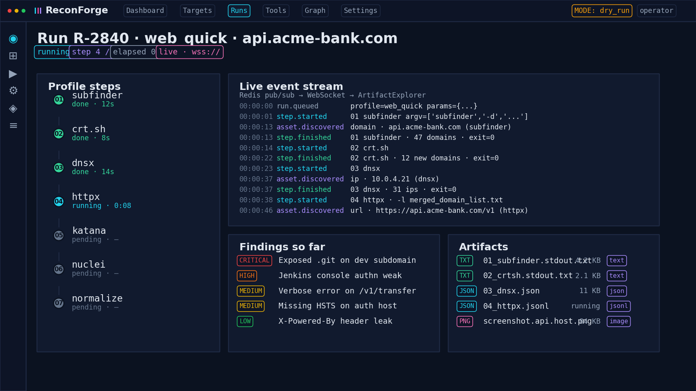
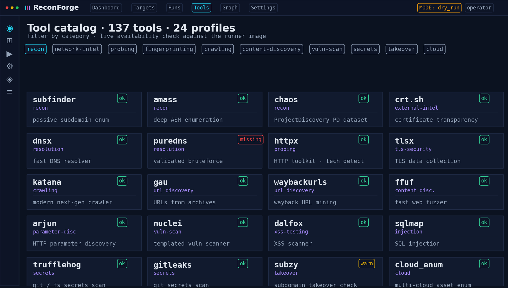

# ReconForge — Multi-panel Web GUI with recon / ASM / bug-bounty workflows

ReconForge is a recon and attack-surface management platform with a multi-panel React UI, a FastAPI control plane, and a YAML-defined tool registry. It runs as a docker-compose stack, as a host-native hybrid dev setup, or as a single-process **desktop app** (Electron shell + Python sidecar, no Redis, no Postgres). All three share the same code.

> **History note.** This repo previously hosted a CLI-only 10-stage pipeline called *OneForAll*. That package is preserved under [`legacy/`](./legacy) and wired into the new system as registry tools (`oneforall`, `oneforall_s01_passive` … `oneforall_s10_report`) and a profile (`oneforall_chain`). See [`legacy/README.md`](./legacy/README.md).

> **Default safety posture: safe dry-run.**
> Fresh checkouts use `EXECUTION_MODE=dry_run` and `ALLOW_LIVE_EXECUTION=false`.
> Real tools require both flags to be deliberately changed, a target to be in
> scope, and active/high-risk authorization checks to pass. Treat live mode as
> an explicitly authorized lab/engagement setting, not a normal default.
> See [`docs/HARDENING.md`](./docs/HARDENING.md) for the operator safety checklist.

## How to run it



Three deployment topologies share the same FastAPI + React stack:

| Mode | When to use | Command |
|---|---|---|
| **Docker compose** | Closest to a real deploy. Postgres + Redis + MinIO + API + worker. | `cp .env.example .env && docker compose up --build` |
| **Hybrid local dev** | Iterating on the API or the UI with reload. Compose runs only the infra. | `docker compose up postgres redis minio` + `uvicorn app.main:app --reload` + `npm run dev` |
| **Desktop app** | Offline / single-user. One Electron window + one Python sidecar, no Redis, no Postgres. | `cd apps/desktop && npm install && npm run dev` (see [apps/desktop/README.md](./apps/desktop/README.md)) |

After docker compose the stack listens on:

- Web UI: <http://localhost:5173>
- API docs: <http://localhost:8000/docs>
- MinIO console: <http://localhost:9001> (`reconforge` / `reconforge-secret`)

## Architecture

```mermaid
flowchart LR
    UI[React Web UI] --> API[FastAPI control plane]
    UI -. ws .-> WS[/ws/runs/:id]

    API --> DB[(SQLite or Postgres)]
    API --> REG[Tool Registry]

    subgraph queue["RUNNER_MODE=queue"]
      API --> REDIS[(Redis)]
      REDIS --> WORKER[External worker]
    end

    subgraph embedded["RUNNER_MODE=embedded (desktop)"]
      API -. in-process .-> WORKER_E[Worker task in API loop]
    end

    WORKER --> TOOLS[CLI tools / dry-run sim]
    WORKER --> DB
    WORKER --> STORE[(MinIO / S3 OR local FS)]
    WORKER --> REDIS

    REDIS --> WS
    WORKER_E -. in-proc broker .-> WS
    WS --> UI
```

The API does **not** execute tools directly. It validates scope, creates a run, persists a `run.queued` event, and pushes a job onto either a Redis list (`queue` mode) or an in-process asyncio queue (`embedded` mode). The worker consumes that job, executes each profile step, persists events/assets/findings/artifacts, and publishes live events through Redis Pub/Sub or the in-process broker. The WebSocket route replays history from Postgres/SQLite on connect, then streams live events from whichever transport is in use.

### Runner modes

```env
RUNNER_MODE=queue       # external worker via Redis. Default for compose.
RUNNER_MODE=embedded    # worker runs inside the API's asyncio loop. No Redis,
                        # no second process. Used by the desktop app.
RUNNER_MODE=in_process  # fire-and-forget asyncio task per run inside the
                        # request handler. Dev only.
```

`event_transport` and `queue_backend` default to `auto`, which resolves to `memory` for `embedded`/`in_process` and `redis` for `queue`. Override either explicitly to mix and match. `/health` reports the resolved values.

## Engagement flow



Every step persists assets, findings, and artifacts as it runs. Profile steps reference upstream output via DAG templates:

```text
{{steps.<tool_id>.stdout_path}}        explicit upstream tool
{{previous.stdout_path}}                most recent prior step
{{upstream.<output_type>.merged_path}}  deduped union across all upstream tools
                                         that declared this output type
```

Steps can also override the tool's argv inline:

```yaml
- tool: dnsx
  argv_replace: [dnsx, -silent, -l, "{{upstream.domain_list.merged_path}}"]
- tool: httpx
  argv_extra: ["-l", "{{upstream.domain_list.merged_path}}"]
```

The rendered argv for each attempt is persisted into `RunStep.meta.argv`, so the UI shows exactly what was executed.

## UI overview

The three main panels — dashboard, live run console, and tool catalog — are rendered below from the same color palette as the live frontend. Regenerate after touching the palette with `python scripts/render-readme-images.py`.

### Dashboard



### Live run console



### Tool catalog



## Network graph

The web UI ships a Network Graph page that renders every workspace as a force-directed graph of `target → domain → url → ip → finding` (plus internal `host` and captured `cred` nodes once `internal_pivot` lands creds). Node size scales with networkx betweenness centrality so pivot points jump out; edges are colored by relationship kind so an operator can spot the critical hops at a glance.

The simulated screenshots below are produced by `scripts/render-graph-screenshots.py`, which uses the same color palette, edge kinds, and centrality logic as the live endpoint at `GET /api/workspaces/{id}/graph`.

### Engagement timeline (`acme-bank.com`)


| Frame | What's happening |
|---|---|
| **T+0 — Passive recon** ([single frame](docs/screenshots/network-graph-passive.png)) | `subfinder + dnsx + httpx` complete. Target hub at the centre, 12 subdomains, 10 URLs, 7 IPs. No findings yet — every edge is gray (`owns / hosts / resolves_to`). |
| **T+15 — Active scan** ([single frame](docs/screenshots/network-graph-attack.png)) | `nuclei + dalfox + arjun` running. 9 findings appear on the outer ring with severity-tinted labels (2 critical: exposed `.git`, Jenkins script-console RCE). Pink `finds` edges light up. |
| **T+45 — Internal pivot** ([single frame](docs/screenshots/network-graph-lateral.png)) | Jenkins RCE → `netexec + impacket` on `10.10.20.0/24`. Three orange `host` nodes (`DC01`, `FILES01`, `WS-FINANCE-07`), two yellow `cred` nodes, and orange `pivots_to` edges crossing from public IPs into the internal segment. 15 findings, 4 critical. |

## AI agents & automation

See **[AGENTS.md](./AGENTS.md)** for how external agents communicate with the control plane: Claude advisor endpoints, structured run briefs (`GET /api/agent/runs/{id}/brief`), WebSocket events, artifact fetch patterns, and the **loot** layer (curated secrets/critical findings vs raw scanner noise).

## Tool library

The registry includes a Sn1per / Enterprise-ASM-inspired set of common building blocks across these categories:

```text
reconnaissance, external-intel, network-intel, resolution, permutation, brand-intel,
probing, fingerprinting, screenshots, tls-security, url-discovery, crawling,
url-normalization, payload-prep, dedupe, content-discovery, vhost-discovery,
parameter-discovery, vulnerability-scanning, injection-testing, xss-testing,
cors-testing, api-security, secrets, supply-chain, takeover, cloud-security,
port-scanning, oob-testing
```

Representative tools:

```text
subfinder, assetfinder, amass, chaos, crt.sh, findomain, sublist3r, github-subdomains,
uncover, asnmap, mapcidr, dnsx, puredns, shuffledns, alterx, dnsgen, dnsrecon, dnstwist,
httpx, httprobe, tlsx, sslscan, testssl.sh, whatweb, wafw00f, gowitness, EyeWitness,
katana, gau, waybackurls, waymore, hakrawler, gospider, paramspider, LinkFinder,
ffuf, feroxbuster, dirsearch, gobuster, arjun, nuclei, nikto, dalfox, kxss, XSStrike,
sqlmap, Commix, kiterunner, GraphQL Cop, graphw00f, jwt_tool, gf, SecretFinder,
TruffleHog, Gitleaks, Retire.js, subzy, cloud_enum, s3scanner, cloudlist, naabu,
rustscan, masscan, nmap, interactsh-client, theHarvester, h8mail, whois,
netexec, impacket, kerbrute, certipy, ldapdomaindump
```

Useful helpers:

```bash
./scripts/tool-matrix.py        # render Markdown table of registry contents
./scripts/check-tools.sh        # show which live binaries are available on this host
./scripts/install-tools.sh      # best-effort bootstrap for common tools
```

Dry-run mode doesn't need these tools installed. Live mode does, and is enforced at run creation: missing binaries return `409 Conflict` rather than failing mid-run.

## Sn1per-style settings pack

```text
packages/platform-config/sniper-inspired.yaml
packages/patterns/sniper-grep-patterns.yaml
packages/wordlists/*.txt
```

The UI **Settings Pack** page surfaces:

- Runtime limits: `MAX_HOSTS`, `THREADS`, `MAX_JAVASCRIPT_FILES`
- Scope guardrails: out-of-scope patterns, active authorization, high-risk approval
- Scanner integrations: Burp, ZAP, OpenVAS/GVM, Nessus, Metasploit import
- API integrations: Shodan, Censys, Hunter.io, Tomba.io, GitHub, WPScan, urlscan.io
- Slack notification toggles
- Web brute stages and wordlists
- Nmap quick/default/full port profiles
- Sn1per-style GREP patterns for XSS, SSRF, redirect, RCE, IDOR, SQLi, LFI, SSTI, debug and high-value parameters
- Plugin matrix grouped by recon, osint, active_web, passive_web, network, email, DAST

API endpoints:

```text
GET  /api/config/effective
GET  /api/config/grep-patterns
GET  /api/config/wordlists
GET  /api/config/plugin-matrix
POST /api/config/reload
```

## Auth & audit

Authentication is mandatory on all `/api/*` routes (`/health` is open). Three roles — `viewer`, `operator`, `admin` — enforced via `require_role()`. Login returns a `rcf_…` bearer token shown ONCE; only its prefix and `sha256(token)` land in the DB. PBKDF2-HMAC-SHA256, 200k iterations, random 16-byte salt.

Bootstrap admin via env: `RECONFORGE_BOOTSTRAP_ADMIN_USERNAME` + `RECONFORGE_BOOTSTRAP_ADMIN_PASSWORD`. Lifespan creates-or-updates the user on every boot.

The audit log (`AuditEvent`) is **append-only and hash-chained**:

```text
signature_n = sha256(prev_signature || canonical_json(row_n))
```

If `RECONFORGE_AUDIT_HMAC_KEY` is set, an HMAC over the same body is also stored. `verify_chain()` re-walks every row and reports breaks (`signature mismatch`, `prev_signature mismatch`, `non-contiguous sequence`, `_hmac mismatch`). `GET /api/auth/audit` (admin-only) shows the most recent rows and the verification result.

Audited actions: every login attempt (success/failure), API key creation/revocation, user creation, workspace creation, target creation, run creation, run cancellation.

## Repository layout

```text
apps/
  api/       FastAPI control plane + worker module + PyInstaller sidecar spec
  web/       React/Vite frontend
  desktop/   Electron shell that wraps the UI + Python sidecar (Phase 3)
packages/
  tool-registry/    YAML tool definitions and profiles
  platform-config/  Sn1per-style policy/config packs
  patterns/         GREP/high-value parameter pattern packs
  wordlists/        small starter wordlists for dev/lab use
infra/
  minio/     MinIO notes
scripts/     helper scripts (render-*.py for docs, install-*.sh for tools)
docs/
  screenshots/      generated imagery — re-render with
                    `python scripts/render-readme-images.py` (banner + UI) or
                    `python scripts/render-graph-screenshots.py` (network graph)
legacy/      original CLI-only OneForAll pipeline, wired into the registry
tests/       pytest suite (300+ tests; legacy/ has its own suite)
```

## Status — desktop track

The Electron desktop shell shipped in three phases. Each phase is a separate PR for review history:

| Phase | What it does | PR |
|---|---|---|
| **1** | Frontend resolves API/WS URLs at runtime via `window.__RECONFORGE_CONFIG__` instead of Vite's build-time env. | [#11](https://github.com/MKlolbullen/oneforall/pull/11) |
| **2** | `RUNNER_MODE=embedded` runs the worker inside the API's own asyncio loop with in-memory event/queue transports. No Redis. Durable cancellation column (`run.cancel_requested_at`). | [#16](https://github.com/MKlolbullen/oneforall/pull/16) |
| **3** | `apps/desktop/` — Electron main spawns a Python sidecar (PyInstaller binary in prod, `uvicorn` from source in dev), polls `/health`, registers the `app://reconforge/` scheme, and loads the React UI. CORS default includes `app://reconforge`. | [#19](https://github.com/MKlolbullen/oneforall/pull/19) |

Not yet shipped (Phase 4 territory):

- `electron-builder` packaging (DMG / NSIS / AppImage)
- Code signing / notarization
- Auto-update channel
- Bundling real recon tools — live mode still needs them on `PATH`

## Safety posture

- Active tools require explicit target authorization.
- User input is validated before run creation.
- Commands are built as argv arrays, not shell strings.
- Dry-run is default.
- Tool definitions declare risk level.
- API and worker are separate processes (queue mode) or share one loop (embedded mode).
- Event history is persisted in Postgres/SQLite.
- Live event fanout uses Redis Pub/Sub or the in-process broker.
- Artifacts are stored outside the database.

Do not expose this on the internet without real auth, TLS, runner isolation, rate limits, signed audit logs, and retention controls.
